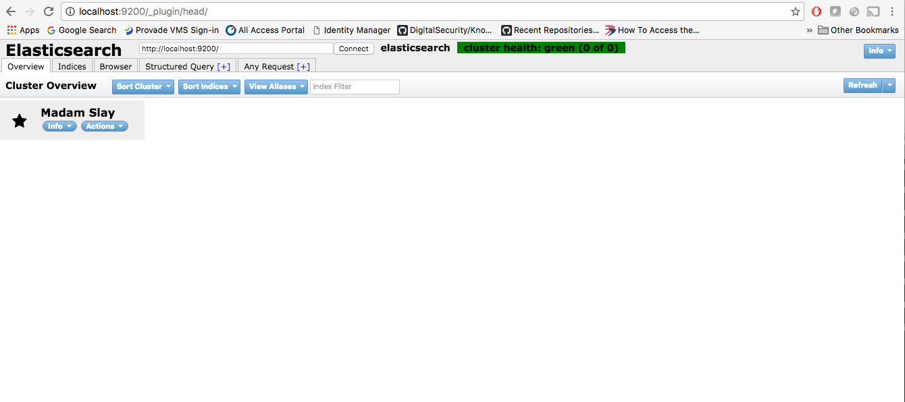
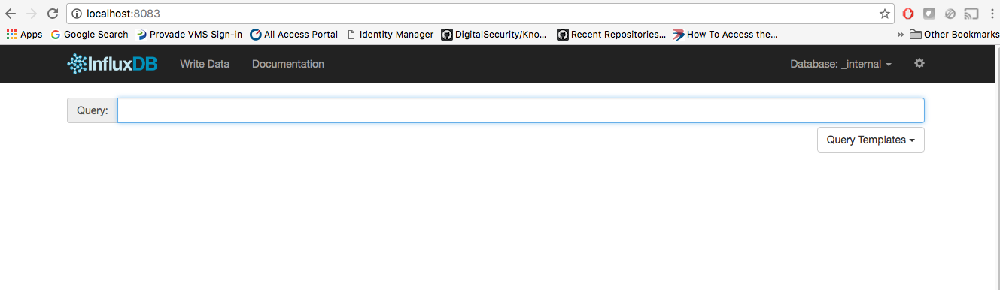
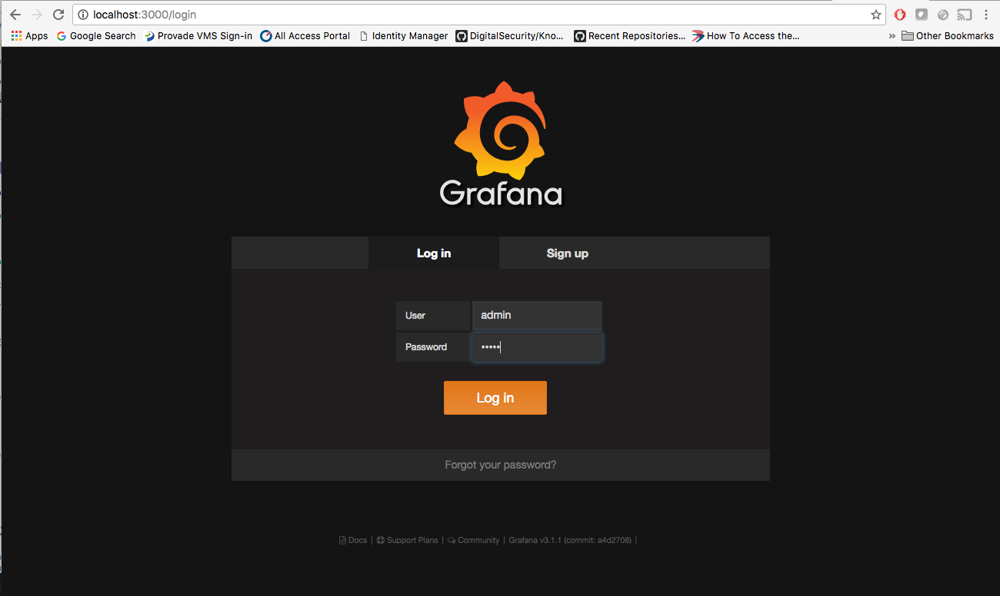
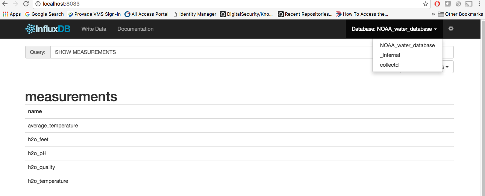
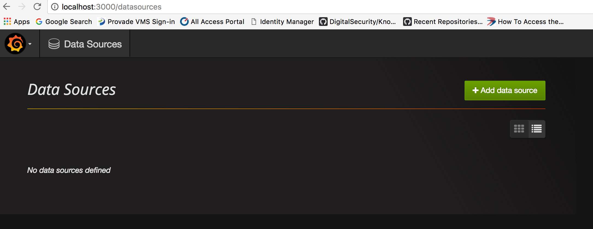
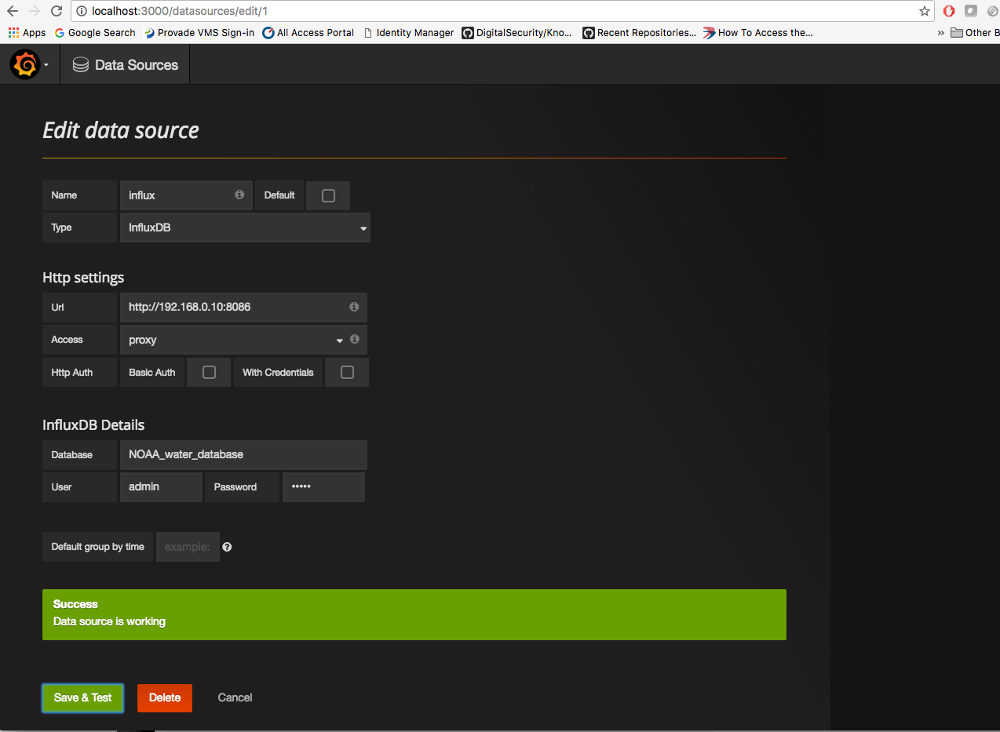
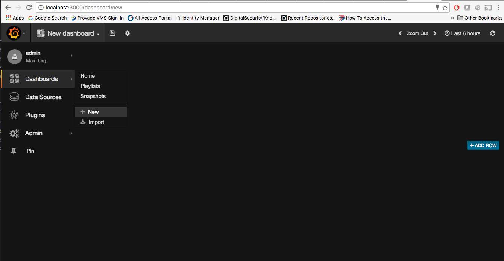
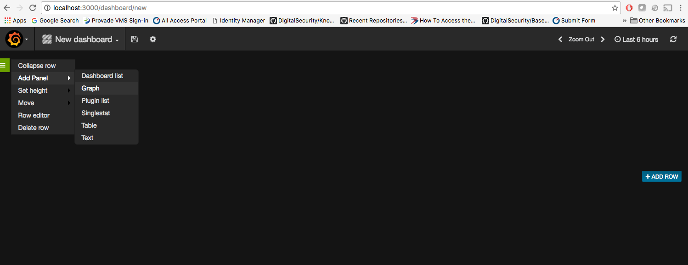
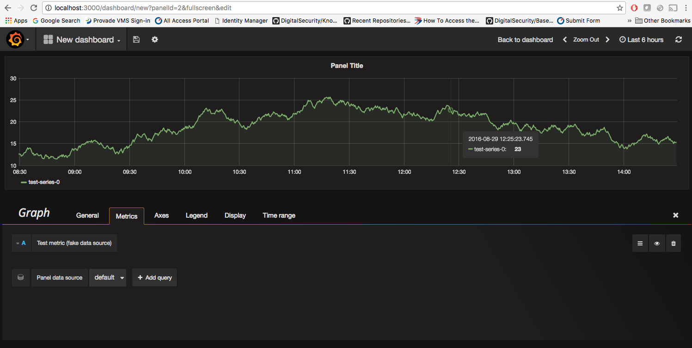
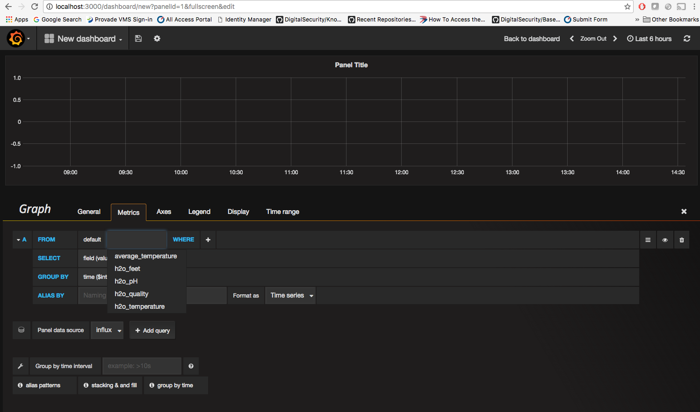

# Monitoring

## Setup Monitoring on Local mac

* To standup the three containers in the mac run:

`$ docker-compose up -d`

* To access the ElasticSearch GUI, it needs a plugin to be installed on the elastic search container, to install it run
```bash
$ docker-compose ps
$ docker exec -it <ElasticSearch container name> bash
$ /usr/share/elasticsearch/bin/plugin install mobz/elasticsearch-head
```


The GUI of ElasticSearch can be accessed at http://localhost:9200/_plugin/head/




* The GUI of Influxdb can be accessed at http://localhost:8083




* The GUI of Grafana can be accessed at http://localhost:3000 with credentials: admin/admin



### Sample data in Influxdb

```bash
$ docker-compose ps
$ docker exec -it <Influxdb container name> bash
$ curl https://s3-us-west-1.amazonaws.com/noaa.water.database.0.9/NOAA_data.txt > NOAA_data.txt
$ influx -import -path=NOAA_data.txt -precision=s
```

* Access http://localhost:8083/(influxdb) and select database NOAA_water_database and Query: SHOW MEASUREMENTS



* Add a Datasource in grafana http://localhost:3000/datasources



* Fill the details similar to image below and save it.



* Create a new Dashboard



* Create rows in dashboards



* Create Graph



* Select Panel data source as Influx and select the queries, one could see all the MEASUREMENTS which got populated in the influxdb in the grafana MEASUREMENTS.

 

* Once appropriate MEASUREMENTS are selected click the "x" on the right corner and save it.

More on Grafana dashboards and UI, Look at http://docs.grafana.org/guides/gettingstarted/

## Setup Monitoring In Openstack

* Navigate to [Openstack Readme](./Openstack) and complete installation steps.
